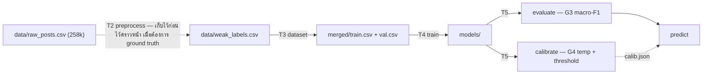

# Thai Twitter Text Classification — 18 หมวด

Classifier ข้อความทวิตเตอร์ภาษาไทยเป็น **18 หมวด (single-label)** พร้อม confidence
เทรนจาก **weak label (tag rule) ทั้งหมด** โดยตรง — ไม่ใช้ LLM และไม่มีชุดมนุษย์ label:
`data/weak_labels.csv` → clean text → map taxonomy (weak 16 → 18 หมวด) → stratified
split → fine-tune `airesearch/wangchanberta-base-att-spm-uncased` → calibrate
(temperature scaling) + threshold → predict พร้อม label `low confidence`

**Decision (2026-08-27):** ยกเลิก LLM ออกจาก pipeline — เดิม `llm_label.py` (Gemini
label/G2) และ G1 per-tag precision gate (referee = LLM) ถูกถอด เพราะ weak labels มี
label + confidence อยู่แล้ว และไม่มี referee/มนุษย์ label มาเป็น ground truth

สถานะปัจจุบัน + รายละเอียดเริ่มจาก **[CLAUDE.md](./CLAUDE.md)** · ดีไซน์เต็มดูที่
**[docs/specs/text-classification-pipeline.md](./docs/specs/text-classification-pipeline.md)**
· โครงสร้างคอลัมน์ทุกไฟล์ที่ **[docs/notes/data-contract.md](./docs/notes/data-contract.md)**

## สารบัญ

- [ภาพรวม pipeline](#ภาพรวม-pipeline)
- [เทคโนโลยี](#เทคโนโลยี)
- [โครงสร้างโปรเจกต์](#โครงสร้างโปรเจกต์)
- [เริ่มต้นใช้งาน](#เริ่มต้นใช้งาน)
- [รันทีละสเตจ](#รันทีละสเตจ)
  - [T3 — Dataset](#t3--dataset)
  - [T4 — Train](#t4--train)
  - [T5 — Evaluate (G3) + Calibrate (G4)](#t5--evaluate-g3--calibrate-g4)
  - [T6 — Predict (CLI)](#t6--predict-cli)
- [Smoke test — พิสูจน์ pipeline](#smoke-test--พิสูจน์-pipeline)
- [Test](#test)
- [แผนงานที่เหลือ](#แผนงานที่เหลือ)

## ภาพรวม pipeline



Gates:
- **G3** — ประเมิน macro-F1 บน `val` ที่ hold-out จาก weak (agreement กับ weak rule —
  ไม่ใช่ความจริงสัมบูรณ์)
- **G4** — temperature scaling + threshold 0.6 → score ต่ำกว่า = `no_match`
  (ใน evaluate นับเป็นคลาสในเมตริก; predict CSV ยังใช้คอลัมน์ `low_confidence`)

## เทคโนโลยี

- Python ≥ 3.12 + [uv](https://docs.astral.sh/uv/)
- pandas / pyarrow / scikit-learn
- PyTorch + Hugging Face `transformers`
- TensorBoard — monitoring ตอนเทรน (`uv run tensorboard --logdir models/model/runs`)
- โมเดล: `airesearch/wangchanberta-base-att-spm-uncased` (default, ตั้งเป็น
  PhayaThaiBERT ได้ที่ `--model`)

## โครงสร้างโปรเจกต์

```
src/textcls/
  config.py      # ทุก path/threshold รวมที่เดียว (CONFIDENCE_THRESHOLD=0.6)
  preprocess.py  # T2 clean ภาษาไทย (ยังไม่ใช้ เก็บไว้ก่อน)
  dataset.py     # T3 clean + map 16→18 + stratified split + class weight
  train.py       # T4 fine-tune
  infer.py       # shared: โหลดโมเดล + predict logits
  evaluate.py    # T5 G3 macro-F1
  calibrate.py   # T5 G4 temperature scaling
  predict.py     # T6 predict batch CLI
  serve.py       # (ยังไม่สร้าง — เลื่อน)
configs/
  weak_label_map.json   # weak taxonomy → 18 หมวด (มนุษย์แก้ได้)
data/                   # (gitignored) ข้อมูลจริง + outputs
models/                 # (gitignored) checkpoints
docs/specs/             # spec · docs/plans/ แผน · docs/notes/ data contract
tests/                  # pytest
```

## เริ่มต้นใช้งาน

```bash
uv sync                # ติดตั้ง dependencies
uv run pytest          # ตรวจว่าทุกอย่างผ่าน
```

ข้อมูล: `data/categories.json` (18 หมวด) + `data/weak_labels.csv` (weak label จริง,
คอลัมน์ `content, flag, category, …`) · mapping weak→18 หมวด แก้ได้ที่
`configs/weak_label_map.json` · แผนผังคอลัมน์ทุกไฟล์ดู
[`docs/notes/data-contract.md`](./docs/notes/data-contract.md)

## รันทีละสเตจ

### T3 — Dataset

Clean text + map taxonomy (weak 16 → 18 หมวด) + stratified split + class weight:

```bash
uv run python -m textcls.dataset \
  --weak data/weak_labels.csv \
  --categories data/categories.json \
  --out data/
```

Output: `data/{merged,train,val}.csv` + `class_weights.json`

### T4 — Train

```bash
uv run python -m textcls.train \
  --train data/train.csv --val data/val.csv \
  --categories data/categories.json --out models/
```

Output: `models/model/` (checkpoint + `run_config.json` บันทึก model/seed/hyperparams)

Monitoring ระหว่างเทรน:
- `models/model/metrics.json` — eval loss + macro-F1 ต่อ epoch (macro-F1 คิดแบบเดียวกับ G3: เฉพาะคลาสที่มีใน val)
- TensorBoard — `uv run tensorboard --logdir models/model/runs` (loss/learning_rate ทุก `--logging-steps`)

### T5 — Evaluate (G3) + Calibrate (G4)

```bash
uv run python -m textcls.evaluate --model models/model/ --test data/val.csv
uv run python -m textcls.calibrate --model models/model/ --val data/val.csv
```

- evaluate → macro-F1 (G3)
- calibrate → คำนวณ T (temperature scaling) เขียน `calib.json` ให้ predict ใช้ (G4)

### T6 — Predict (CLI)

```bash
# แบบ pipeline (non-interactive): ระบุคอลัมน์ข้อความเอง
uv run python -m textcls.predict --model models/model/ --input in.csv --output out.csv --text-column content

# แบบ interactive: เลือก model (จาก models/) + sheet/คอลัมน์ใน terminal,
# preview 5 แถว + ยืนยัน, progress bar + bar chart กระจาย label
# (ใช้ได้กับ .xlsx ด้วย — ต้องมี openpyxl)
uv run python -m textcls.predict --input in.xlsx
```

- รับ `.csv` และ `.xlsx` · ไม่ระบุ `--output` → เขียน `<ชื่อเดิม>_predicted.<นามสกุล>` (ต้นฉบับไม่ถูกแก้)
- ไม่ระบุ `--model` (interactive) → เลือกจาก checkpoint ใน `models/` ที่มี `run_config.json`
  (มีตัวเดียวใช้เลย); โหมด non-interactive ต้องระบุ `--model` เอง
- ไฟล์ไม่มีแถว header → ใส่ `--no-header` (ทุกบรรทัดเป็นข้อมูล คอลัมน์ชื่อ `col_1..col_N`
  — non-interactive ระบุ `--text-column col_1`, output ก็ไม่มี header เหมือน input)
- แถวที่คอลัมน์ข้อความว่าง → `category`/`confidence` เว้นว่าง, `low_confidence` = False
- score ผ่าน temperature scaling จาก `calib.json` เสมอ (ไม่มีไฟล์ → T=1.0) และ
  `< threshold` → `low_confidence` = True (G4)

Output: ไฟล์เดิม + คอลัมน์ `category` + `confidence` + `low_confidence`
(`serve.py` API ยังเลื่อน — ถ้าต้องการค่อยสร้าง)

## Smoke test — พิสูจน์ pipeline

Smoke ครบ chain บน GPU: train 736 แถว → calibrate (T≈0.22) → evaluate
(macro-F1 ≈ 0.48) → predict — ยังไม่เทรนเต็ม 128k

## Test

```bash
uv run pytest
```

37 tests — ครอบคลุม config, preprocess, dataset, train (mock tokenizer), evaluate,
calibrate, predict · เน้น unit test ไม่โหลดโมเดลจริง/ไม่เรียก API

## แผนงานที่เหลือ

| Task | งาน | สถานะ |
|------|-----|-------|
| 1 | scaffold (uv + config) | ✅ |
| 2 | preprocess (จาก raw_posts 258k) | ⏳ deferred — เปิดใช้เมื่อต้องการ ground truth (ถามก่อน) |
| 3 | dataset (clean + map 16→18 + split) | ✅ |
| 4 | train | ✅ |
| 5 | evaluate (G3) + calibrate (G4) | ✅ |
| 6 | predict CLI | ✅ |
| — | serve (API) | ⏳ เลื่อน |

ยังรอ: เทรนเต็ม 128k แถว · `religion`/`child_sexual_content` ไม่มี weak source
(no train data, class weight = 0) · mapping weak→18 หมวด (default ยังรอ confirm)
